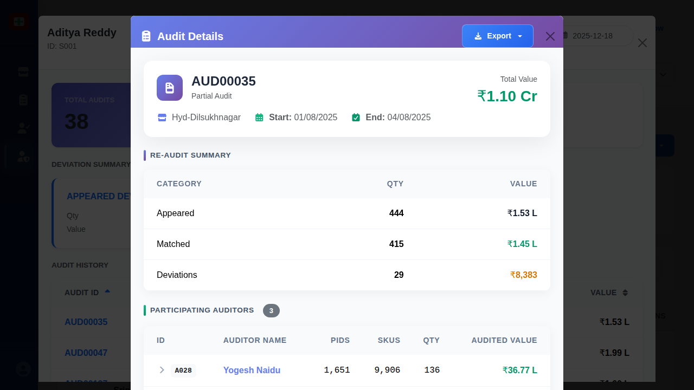

# Audit-Specific Details Modal

## When This Modal Appears

This modal appears when:
- A user clicks on an Audit ID link (blue clickable text) in the Supervisor Details Modal's Audit History table
- A user clicks on an Audit ID link in the Auditor Details Modal's Audit History table
- Management wants to review comprehensive details about one specific audit
- Investigation is needed into audit quality, team composition, or deviation details

## Complete UI Breakdown

### Modal Header

**Title and Export**
- **Title**: "Audit Details" with document icon
- **Export Button**: Blue button with "Export" label and download icon
- **Location**: Top of modal header
- **Purpose**: Export this specific audit's complete data to Excel or PDF

**Close Button**
- **Icon**: X symbol in top-right corner
- **Purpose**: Closes Audit Details Modal
- **When clicked**: Returns to previous modal (Supervisor Details or Auditor Details)
- **Note**: Does not close the underlying modal - maintains navigation context

### Audit Identification Section

**Audit ID Badge**
- **Display**: Large purple badge with audit ID (e.g., "AUD00035")
- **Icon**: Document icon next to ID
- **Purpose**: Clearly identifies which audit is being viewed

**Audit Type Label**
- **Text**: Type of audit (e.g., "Partial Audit", "Full Audit", "Select SKUs")
- **Style**: Gray text below audit ID
- **Purpose**: Quickly identify audit scope

**Store Information**
- **Store Icon**: Building/location icon
- **Store Name**: Full store name (e.g., "Hyd-Dilsukhnagar")
- **Purpose**: Shows where this audit was conducted

**Date Range**
- **Start Date**: "Start: 01/08/2025"
- **End Date**: "End: 04/08/2025"  
- **Format**: Clear labeled dates with calendar icons
- **Purpose**: Shows audit duration (in this example: 4 days)
- **Business insight**: Longer durations may indicate complexity or resource constraints

**Total Value Card**
- **Large Display**: "₹1.10 Cr"
- **Label**: "Total Value"
- **Style**: Prominent green text
- **Purpose**: Shows aggregate value of inventory audited
- **Business purpose**: High-value audits receive more scrutiny

### Re-Audit Summary Table

**Section Title**: "Re-Audit Summary"
**Purpose**: Shows quality verification results comparing initial audit with re-audit findings

**Table Structure** (3 columns: Category, Qty, Value):

**Appeared Row**
- **Category**: "Appeared"
- **Qty**: Number of deviations found during initial audit (e.g., "444")
- **Value**: Monetary value of those deviations (e.g., "₹1.53 L")
- **Purpose**: Shows total discrepancies identified by audit team
- **Business purpose**: Baseline for quality measurement

**Matched Row**
- **Category**: "Matched"  
- **Qty**: Deviations confirmed as correct during re-audit (e.g., "415")
- **Value**: Confirmed monetary value (e.g., "₹1.45 L")
- **Color**: Often green-highlighted to show positive validation
- **Purpose**: Shows how many findings were accurate
- **Quality metric**: Match rate = 415/444 = 93.5% accuracy

**Deviations Row**
- **Category**: "Deviations"
- **Qty**: Discrepancies that were incorrect or changed (e.g., "29")
- **Value**: Value of errors (e.g., "₹8,383")
- **Color**: Often yellow/orange-highlighted as warning
- **Purpose**: Shows audit errors or changes needed
- **Quality metric**: Error rate = 29/444 = 6.5% (lower is better)

### Participating Auditors Section

**Section Title**: "Participating Auditors"
**Count Badge**: Circle showing number of auditors (e.g., "3")
**Purpose**: Shows team composition for this audit

**Auditors Table** (6 columns):

1. **ID**: Auditor identifier (e.g., "A028") - May be clickable
2. **Auditor Name**: Full name (e.g., "Yogesh Naidu")
3. **PIDs**: Product IDs this auditor handled
4. **SKUs**: SKUs this auditor processed
5. **Qty**: Quantity this auditor audited
6. **Audited Value**: Monetary value this auditor was responsible for

**Sample Data**:
- A028 | Yogesh Naidu | 1,651 | 9,906 | 136 | ₹36.77 L
- A015 | Bharath Reddy | 1,651 | 9,906 | 130 | ₹36.77 L
- A013 | Lokesh Rao | 1,651 | 9,906 | 178 | ₹36.77 L

**Row Interaction**:
- **Hover**: Row highlights
- **Click on Auditor ID**: May open Auditor Details Modal (context-dependent)
- **Purpose**: Drill down to individual auditor performance

**Insights from Table**:
- **Equal distribution**: PIDs and SKUs often equal across auditors (fair workload division)
- **Quantity differences**: Qty column varies (e.g., 136 vs. 130 vs. 178) showing actual items processed
- **Team size**: Number of rows indicates team composition
- **Workload balance**: Can assess if work was distributed fairly

### Bottom Close Button

**Additional Close Button**
- **Label**: "Close"
- **Style**: Standard button at bottom-center of modal
- **Purpose**: Alternative close method for better accessibility
- **When clicked**: Same effect as X button - closes modal and returns to previous screen

## Interaction Behavior

### Opening the Modal
- **Trigger**: Click blue Audit ID link in Supervisor Details or Auditor Details modal
- **Animation**: New modal slides in or fades in on top of existing modal
- **Layering**: Previous modal remains open but dimmed in background
- **Focus**: New modal receives keyboard and mouse focus

### Closing the Modal
Three methods available:
1. **Click X button (top-right)**: Standard close action
2. **Click Close button (bottom-center)**: Alternative close action
3. **Press Escape key**: Keyboard shortcut

**When closed**:
- Audit Details Modal closes and disappears
- Previous modal (Supervisor or Auditor Details) becomes active again
- User can continue reviewing other audits
- No data is lost from previous modal

### Export Action
- **Click Export button**:
  - Dropdown may appear showing format options (Excel, PDF)
  - Or direct download of default format
  - File contains all audit details, re-audit summary, and auditor breakdown
  - Filename: "audit-{ID}-details-YYYY-MM-DD.xlsx" or similar

**Export contents**:
- Audit identification and metadata
- Re-audit summary with quality metrics
- Complete auditor contribution breakdown
- Timestamps and supervisor information

### Click Auditor ID (If Clickable)
- **Click on Auditor ID** (e.g., "A028"):
  - May open new Auditor Details Modal
  - Or may show tooltip/quick view of auditor info
  - Behavior depends on implementation and user permissions
- **Purpose**: Quick access to auditor details without losing audit context

### Reviewing Re-Audit Summary
- **Read Appeared row**: Understand total findings
- **Read Matched row**: Assess accuracy (green = good)
- **Read Deviations row**: Identify errors (lower = better quality)
- **Calculate match rate**: (Matched / Appeared) × 100 = quality percentage
- **Business insight**: Match rates above 90% are typically considered good; below 85% may trigger review

### Reviewing Auditor Contributions
- **Scan table**: Quick view of team composition
- **Compare Qty values**: Identify who processed most items
- **Check distribution**: Verify work was divided fairly
- **Click for details**: Drill down to specific auditor if needed

## Purpose of Every Action

### View Audit-Specific Details
- **Business purpose**: Complete transparency into individual audit quality and execution
- **Operational purpose**: Verify audit was performed correctly and findings are accurate
- **Quality control**: Validate re-audit results and identify any discrepancies
- **Investigation**: Deep dive when issues or questions arise about specific audit

### Export Audit Details
- **Business purpose**: Share specific audit data with stakeholders, auditors, or store managers
- **Operational purpose**: Create documentation for follow-up actions or store communication
- **Record keeping**: Maintain detailed audit records for compliance or historical reference
- **Analysis**: Import into other systems for deeper analysis or reporting

### Review Re-Audit Summary
- **Business purpose**: Measure audit quality and reliability
- **Operational purpose**: High match rates indicate quality audit work; low match rates trigger auditor retraining
- **Financial impact**: Deviation values show potential inventory losses or gains
- **Accountability**: Track which audits have quality issues

### Review Auditor Participation
- **Business purpose**: Understand team composition and individual contributions
- **Operational purpose**: Verify appropriate team size and skill mix for audit complexity
- **Workload assessment**: Ensure work was distributed fairly among team members
- **Performance evaluation**: Identify which auditor handled which portions (useful for quality issues)
- **Planning**: Inform future team composition for similar audits

### Calculate Quality Metrics
- **Match rate calculation**: (Matched / Appeared) shows audit accuracy percentage
- **Error rate calculation**: (Deviations / Appeared) shows mistake percentage
- **Business purpose**: Quantitative quality assessment for management dashboards
- **Operational purpose**: Track quality trends over time and by auditor/supervisor

### Navigate Between Modals
- **Business purpose**: Maintain context while drilling down through hierarchy (Supervisor → Audit → Auditor)
- **Operational purpose**: Efficient investigation workflow without losing place
- **User experience**: Quick navigation between related information

### Compare Auditor Quantities
- **Business purpose**: Identify productivity differences within same audit
- **Operational purpose**: Higher quantity with same PIDs/SKUs may indicate efficiency or thoroughness
- **Fairness check**: Ensure workload was balanced appropriately
- **Quality correlation**: Compare quantity processed with error rates

## Visual Documentation

The screenshot shows the Audit Details Modal for audit AUD00035, a Partial Audit conducted at Hyd-Dilsukhnagar store from August 1-4, 2025, covering ₹1.10 Cr in total value. The Re-Audit Summary shows excellent quality with 415 of 444 appeared deviations being matched (93.5% match rate), with only 29 deviations requiring revision (valued at ₹8,383). The Participating Auditors section shows a team of 3 auditors (Yogesh Naidu, Bharath Reddy, and Lokesh Rao) who equally shared the workload of 1,651 PIDs and 9,906 SKUs each, though with varying quantities processed (136, 130, and 178 respectively). The modal provides complete transparency into audit execution, quality verification results, and team composition for management review and accountability. The Export button allows downloading this detailed information, and the modal can be closed to return to the previous Supervisor or Auditor Details view.
