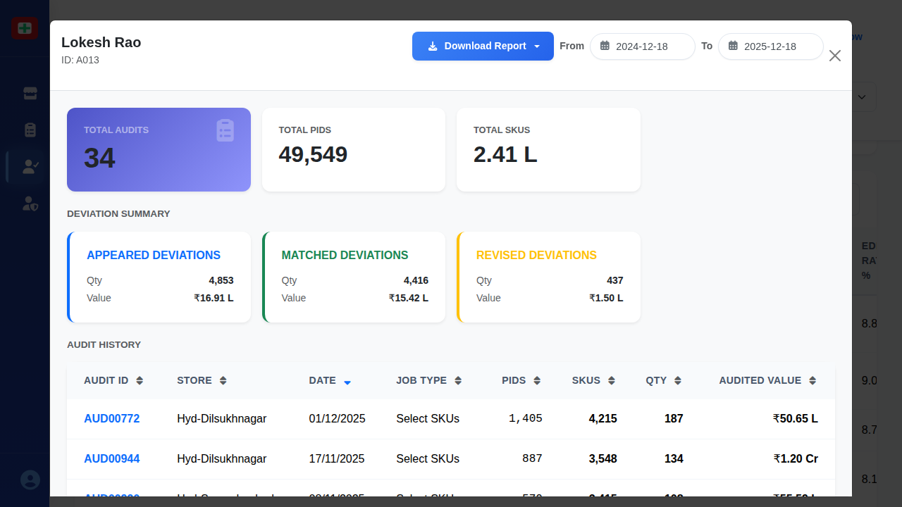

# Auditor Details Modal

## When This Modal Appears

This modal appears when:
- A user clicks on any auditor row in the Auditor Performance Screen table
- Management wants to review detailed performance metrics for a specific auditor
- A drill-down view of an individual auditor's productivity and quality is needed

## Complete UI Breakdown

### Modal Header

**Auditor Name and ID**
- **Display**: Large auditor name (e.g., "Lokesh Rao") with smaller ID below (e.g., "ID: A013")
- **Purpose**: Confirms which auditor's details are being viewed
- **Location**: Top-left of modal

**Download Report Button**
- **Label**: "Download Report" with download icon
- **Style**: Blue button
- **Location**: Top-right of header
- **Purpose**: Generates a detailed PDF report of this auditor's performance
- **When clicked**: File downloads immediately with filename like "auditor-A013-report-YYYY-MM-DD.pdf"
- **Business purpose**: Share auditor performance data with supervisors or HR for reviews

**Date Range Selectors**
- **From Date Picker**: Calendar input showing start date (default: one year ago)
- **To Date Picker**: Calendar input showing end date (default: today)
- **Purpose**: Filter all metrics and audit history to specific date range
- **When changed**: All data in modal updates to reflect selected period
- **Business purpose**: Review performance trends, seasonal variations, or improvement over time

**Close Button (X)**
- **Icon**: X symbol in top-right corner
- **Purpose**: Closes modal and returns to Auditor Performance Screen
- **When clicked**: Modal disappears with fade-out animation

### Summary Metrics Cards (Top Row)

Three white cards displaying key auditor statistics:

**Total Audits Card**
- **Value**: Large number (e.g., "34")
- **Style**: Purple/blue background card with audit icon
- **Purpose**: Shows total number of audits this auditor participated in during date range
- **Business purpose**: Measure auditor workload and activity level

**Total PIDs Card**
- **Value**: Large number (e.g., "49,549")
- **Purpose**: Total Product IDs this auditor has audited
- **Business purpose**: Measure scale and volume of work performed

**Total SKUs Card**
- **Value**: Large number with "L" suffix (e.g., "2.41 L" meaning 241,000)
- **Purpose**: Total Stock Keeping Units this auditor has audited
- **Business purpose**: Measure complexity and scope of audit work

### Deviation Summary Section

**Section Title**: "DEVIATION SUMMARY"
**Purpose**: Shows quality metrics comparing auditor's work with re-audit verification results

Three columns with colored borders (blue, green, yellow):

**Appeared Deviations (Blue Border)**
- **Qty Value**: Number of items where auditor found discrepancies (e.g., "4,853")
- **Value Amount**: Total monetary value of deviations found (e.g., "₹16.91 L")
- **Purpose**: Discrepancies this auditor identified during audit work
- **Business purpose**: Measures auditor's thoroughness in finding inventory issues

**Matched Deviations (Green Border)**
- **Qty Value**: Number of deviations confirmed during re-audit (e.g., "4,416")
- **Value Amount**: Monetary value confirmed (e.g., "₹15.42 L")
- **Purpose**: Deviations validated as correct by verification process
- **Match Rate**: Can calculate as (4,416 / 4,853) × 100 = 91% match rate
- **Business purpose**: Primary quality indicator - higher match rate means higher accuracy

**Revised Deviations (Yellow Border)**
- **Qty Value**: Number of deviations that were incorrect or changed (e.g., "437")
- **Value Amount**: Value of corrections (e.g., "₹1.50 L")
- **Purpose**: Deviations where auditor made errors or needed correction
- **Edit Rate**: Can calculate as (437 / 4,853) × 100 = 9% edit rate
- **Business purpose**: Lower numbers indicate higher audit quality and accuracy

### Audit History Table

**Section Title**: "AUDIT HISTORY"
**Purpose**: Complete chronological list of all audits performed by this auditor

**Table Columns** (left to right):

1. **Audit ID**: Unique identifier (e.g., "AUD00772") - Clickable link in blue
2. **Store**: Store name where audit was performed
3. **Date**: Audit completion date (DD/MM/YYYY format)
4. **Job Type**: Type of audit performed (Full Audit, Partial Audit, Select SKUs)
5. **PIDs**: Number of Product IDs audited in this audit
6. **SKUs**: Number of Stock Keeping Units audited in this audit
7. **QTY**: Quantity of items this auditor processed
8. **Audited Value**: Total monetary value audited (in Lakhs "L" or Crores "Cr")

**Row Interaction**:
- **Hover**: Row background lightens, cursor changes to pointer
- **Click on Audit ID**: Opens the Audit Details Modal showing full audit information
- **Purpose**: Drill down from auditor performance to specific audit details

**Table Sorting**:
- **Sortable columns**: All columns have sort arrows in header
- **Click column header**: Toggles between ascending and descending sort
- **Default sort**: Most recent audits first (by Date, descending)
- **Purpose**: Analyze patterns like recent vs. older performance, high-value vs. low-value audits

**Scrolling**:
- **Behavior**: Table scrolls vertically if audit history exceeds visible area
- **Scroll bar**: Appears on right side of table
- **Purpose**: View complete history even for experienced auditors with many audits

**Data Insights from Table**:
- **Productivity**: Can see how many audits per month
- **Complexity**: Can compare SKU counts to identify challenging vs. simple audits
- **Value handling**: Can see if auditor works on high-value or low-value stores
- **Consistency**: Can observe if performance metrics vary by audit type

## Interaction Behavior

### Opening the Modal
- **Trigger**: Click any row in Auditor Performance Screen table
- **Animation**: Modal fades in over semi-transparent dark overlay
- **Effect**: Background screen becomes non-interactive and dimmed
- **Data loading**: Metrics and history load from server (may show brief spinner if large dataset)

### Closing the Modal
Three methods available:
1. **Click X button**: Standard close action in top-right
2. **Click outside modal**: Click anywhere on dark overlay background
3. **Press Escape key**: Keyboard shortcut for closing

**When closed**:
- Modal fades out with smooth animation
- Dark overlay disappears
- Background Auditor Performance Screen becomes interactive
- User returns to same scroll position as before

### Date Range Filtering
- **Select From date**: 
  - Calendar popup appears
  - Choose start date
  - Modal updates with loading indicator
- **Select To date**:
  - Calendar popup appears
  - Choose end date
  - All data refreshes automatically
- **Invalid range** (To date before From date):
  - Error message appears
  - Prevents update until valid range selected

**After date range change**:
- Summary cards recalculate showing filtered totals
- Deviation metrics update to reflect selected period
- Audit History filters to only show audits within date range
- No page reload - updates happen in real-time

### Download Report Action
- **Click Download Report**:
  - Button shows loading spinner/disabled state
  - Server generates comprehensive PDF report
  - Report includes all visible metrics and full audit history
  - Browser download notification appears
  - File downloads with name: "auditor-{ID}-{fromDate}-{toDate}.pdf"
- **Report contents**:
  - Auditor profile and summary metrics
  - Detailed deviation analysis
  - Complete audit history table
  - Performance trends and graphs
  - Formatted for printing and sharing

### Audit ID Click Behavior
- **Click any blue Audit ID link** (e.g., "AUD00772"):
  - Current Auditor Details Modal stays open (but dimmed/background)
  - New Audit Details Modal opens on top
  - Layered modal approach (two modals stacked)
  - View complete audit information
- **Close Audit Details Modal**:
  - Returns to Auditor Details Modal (still open)
  - Can click another Audit ID to view different audit
  - Efficient workflow for investigating multiple audits

### Sorting and Navigation
- **Click any sortable column header**:
  - Sort indicator (arrow) updates
  - Table rows rearrange immediately
  - Maintains current scroll position if possible
- **Scroll through audit history**:
  - Smooth scrolling within modal
  - Header stays fixed at top
  - Scroll bar indicates position in long lists

## Purpose of Every Action

### View Auditor Details
- **Business purpose**: Evaluate individual auditor effectiveness, accuracy, and productivity
- **Operational purpose**: Identify auditors needing additional training or recognition
- **Management use**: Support performance reviews, bonus decisions, and skill development planning
- **Quality control**: Monitor audit accuracy trends over time

### Download Report
- **Business purpose**: Create formal documentation for HR files, performance reviews, or auditor feedback sessions
- **Operational purpose**: Share detailed performance data with supervisors or training coordinators
- **Record keeping**: Maintain historical performance records
- **Meeting preparation**: Print reports for review meetings or one-on-ones

### Filter by Date Range
- **Business purpose**: Compare auditor performance across different periods (monthly, quarterly, yearly)
- **Operational purpose**: Identify performance trends - improvement, decline, or consistency
- **Training assessment**: Measure impact of training programs by comparing before/after periods
- **Seasonal analysis**: Understand if performance varies by time of year

### View Deviation Metrics
- **Business purpose**: Primary indicator of audit quality and accuracy
- **Operational purpose**: High match rate (green vs. blue) indicates reliable auditor; low match rate suggests need for retraining
- **Quality control**: Track accuracy quantitatively to maintain audit integrity
- **Benchmarking**: Compare against team averages or quality standards

### Review Audit History
- **Business purpose**: Understand which stores, audit types, and complexity levels this auditor handles
- **Operational purpose**: Verify auditor is working at appropriate skill level and store complexity
- **Workload verification**: Ensure fair distribution of work and identify periods of high/low activity
- **Assignment planning**: Inform future task assignments based on past experience and performance

### Click Audit ID for Details
- **Business purpose**: Investigate specific audits when evaluating auditor performance
- **Operational purpose**: Drill down to understand context of errors or successes
- **Problem-solving**: Trace quality issues to specific audits and identify patterns
- **Learning**: Review examples of well-performed audits for training purposes

### Sort Audit History
- **Business purpose**: Identify patterns - recent performance, highest-value audits, most complex audits
- **Operational purpose**: Quickly find specific audits by date, value, or store
- **Analysis**: Compare different types of audits (Full vs. Partial vs. Select SKUs)
- **Efficiency**: Navigate large audit histories more effectively

## Visual Documentation

The screenshot shows the Auditor Details Modal for Lokesh Rao (ID: A013). The modal displays his performance over the past year: 34 total audits completed, covering 49,549 PIDs and 2.41 lakh SKUs. The Deviation Summary shows excellent quality metrics with a 91% match rate (4,416 matched out of 4,853 appeared deviations), indicating high accuracy in his audit work. The Audit History table lists all 34 audits chronologically from most recent to oldest, showing consistent work across multiple stores including Hyd-Dilsukhnagar, Hyd-Secunderabad, and others. Each row shows the audit ID (clickable for drill-down), store name, date, job type, and metrics like PIDs, SKUs, quantity, and audited value ranging from ₹32.55 L to ₹2.36 Cr. The modal provides comprehensive insight into individual auditor performance for management review and quality assessment.
