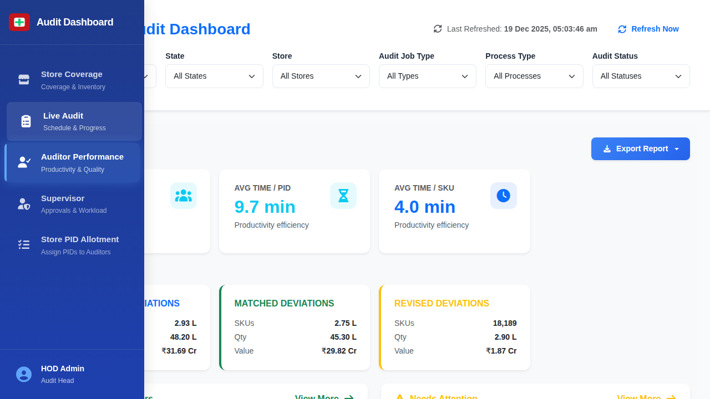

# Auditor Performance Screen

## When This Screen Appears

This screen appears when:
- User clicks "Auditor Performance" in the sidebar navigation
- User wants to review individual auditor productivity and quality metrics
- Management needs to evaluate auditor performance for reviews or training

*Auditor Performance dashboard showing productivity metrics and detailed auditor table*

## Complete UI Breakdown

### Export Report Button
- **Label**: "Export Report"
- **Type**: Blue button with download icon
- **Location**: Top-right corner
- **Purpose**: Download comprehensive auditor performance data
- **What happens on click**: Generates file with all auditor metrics and rankings
- **Business purpose**: Enable offline analysis and performance reviews

### Performance KPI Cards (Top Row)

#### Total Auditors Card
- **Title**: "Total Auditors"
- **Large Number**: "40"
- **Subtitle**: "Active auditors"
- **Icon**: People group icon (cyan/blue)
- **Purpose**: Shows total count of auditors in the system
- **What it represents**: Current active workforce conducting audits
- **Business purpose**: Track team size and resource capacity

#### Average Time per PID Card
- **Title**: "AVG TIME / PID"
- **Large Number**: "9.9 min"
- **Subtitle**: "Productivity efficiency"
- **Icon**: Hourglass icon (cyan)
- **Purpose**: Shows average time auditors take per Physical Inventory Document
- **What it represents**: Speed metric for document-level processing
- **Business purpose**: Benchmark productivity and identify improvement opportunities

#### Average Time per SKU Card
- **Title**: "AVG TIME / SKU"
- **Large Number**: "4.0 min"
- **Subtitle**: "Productivity efficiency"
- **Icon**: Clock icon (blue)
- **Purpose**: Shows average time auditors take per Stock Keeping Unit
- **What it represents**: Speed metric for individual item processing
- **Business purpose**: Measure detailed productivity and estimate audit timelines

#### Match Rate Card
- **Title**: "MATCH RATE"
- **Large Number**: "90.8%"
- **Subtitle**: "Accuracy vs re-audit"
- **Icon**: Target/bullseye icon (green)
- **Purpose**: Shows overall auditor accuracy percentage
- **What it represents**: How often auditor counts match system records or re-audit verification
- **High percentage = good**: Indicates quality and accuracy of work
- **Business purpose**: Monitor audit quality and identify training needs

#### Edit Rate Card
- **Title**: "EDIT RATE"
- **Large Number**: "9.2%"
- **Subtitle**: "Quality indicator"
- **Icon**: Edit/pencil icon (yellow)
- **Purpose**: Shows percentage of audit entries that required correction
- **What it represents**: Frequency of errors or changes needed
- **Low percentage = good**: Fewer edits mean higher initial accuracy
- **Business purpose**: Quality control metric for process improvement

### Performance Rankings Section

#### Top Performers Panel (Left)
- **Title**: "Top Performers" with trophy icon
- **List Format**: Numbered ranking (1, 2, 3)
- **Each Entry Shows**:
  - Rank number with medal-style badge
  - Auditor name in bold
  - Performance percentage
- **Sample Data**:
  1. Uday Varma - 91.5%
  2. Mahesh Babu - 91.2%
  3. Pavan Kalyan - 91.2%
- **Purpose**: Highlight best-performing auditors
- **Business purpose**: Recognition, motivation, and benchmark setting

#### Needs Attention Panel (Right)
- **Title**: "Needs Attention" with warning icon
- **List Format**: Numbered ranking (1, 2, 3)
- **Each Entry Shows**:
  - Rank number
  - Auditor name in bold
  - Performance percentage (lower than top performers)
- **Sample Data**:
  1. Rakesh Kumar - 90.2%
  2. Sudheer Naidu - 90.2%
  3. Rahul Varma - 90.3%
- **Purpose**: Identify auditors who may need coaching or support
- **Note**: Even "needs attention" auditors show 90%+ performance
- **Business purpose**: Proactive intervention to maintain quality standards

### Auditor Productivity Table

#### Table Header Section
- **Title**: "Auditor Productivity Summary"
- **Subtitle**: "Click on any auditor to view detailed performance metrics"
- **Search Box**: "Search by auditor name..."
  - Real-time filtering as user types
  - Searches across auditor ID and name

#### Table Column Headers (All Sortable)
1. **Auditor ID**: Unique identifier (e.g., A039, A031)
2. **Auditor Name**: Full name of the auditor
3. **Total Audits**: Count of audits completed
4. **Allotted PIDs**: Number of inventory documents assigned
5. **Allotted SKUs**: Number of products assigned
6. **Allotted Qty**: Total quantity of units to audit
7. **Avg Time/PID**: Average minutes per document
8. **Avg Time/SKU**: Average minutes per product
9. **Match Rate %**: Accuracy percentage
10. **Edit Rate %**: Correction frequency percentage
11. **Total Value**: Monetary value of audited inventory
12. **Actions**: Additional action buttons (if any)

#### Sort Functionality
- Click header to sort ascending
- Click again to sort descending
- Visual indicator shows current sort column and direction
- Allows finding highest/lowest in any metric

#### Sample Row Data
- **A039 - Srikanth Rao**: 118 audits, 1,29,964 PIDs, 5,97,875 SKUs, 17,635 qty, 9.86 min/PID, 4.06 min/SKU, 90.9% match, 9.1% edit, ₹61.65 L value
- **A031 - Ajay Rao**: 106 audits, 1,31,091 PIDs, 5,88,118 SKUs, 15,577 qty, 9.57 min/PID, 3.93 min/SKU, 90.4% match, 9.6% edit, ₹52.71 L value
- Additional rows continue with similar detailed metrics

#### Row Hover and Click
- Rows highlight on hover
- Cursor changes to pointer
- Click opens detailed auditor performance view
- Shows audit history, trends, and specific store performance

## Interaction Behavior

### Search Functionality
1. User types auditor name in search box
2. Table filters in real-time
3. Only matching rows display
4. Can type partial names
5. Search is case-insensitive

### Sorting Process
1. User clicks on column header
2. Up/down arrow indicator appears
3. Table reorganizes by that column
4. Numerical columns sort by value
5. Text columns sort alphabetically
6. Click again to reverse order

### Row Click Flow
1. User clicks on any auditor row
2. Detailed performance screen opens
3. Shows:
   - Complete audit history
   - Performance trends over time
   - Store-by-store breakdown
   - Quality metrics detail
4. Back button returns to summary table

### Export Action
1. User clicks "Export Report" button
2. System generates file with:
   - All auditor records
   - All performance metrics
   - Rankings and categories
   - Summary statistics
3. File downloads in Excel or PDF format
4. Can be used for HR reviews or analysis

### Performance Comparison
1. Users can sort by different columns to compare:
   - Fastest auditors (Avg Time/SKU)
   - Most accurate (Match Rate %)
   - Highest productivity (Total Audits)
   - Most valuable work (Total Value)
2. Identify patterns and outliers
3. Make data-driven staffing decisions

## Purpose of Every Action

### Summary Metrics
- **Operational purpose**: Understand overall team performance at a glance
- **Decision support**: Identify if team-wide intervention needed
- **Benchmarking**: Set expectations for individual performance
- **Capacity planning**: Estimate audit capacity based on time metrics

### Top Performers Recognition
- **Operational purpose**: Identify best practices from high performers
- **Decision support**: Select auditors for difficult or high-value audits
- **Employee motivation**: Recognition drives engagement
- **Training**: Use top performers as mentors or trainers

### Needs Attention Identification
- **Operational purpose**: Proactively address performance issues
- **Decision support**: Prioritize coaching and training resources
- **Quality maintenance**: Prevent quality decline through early intervention
- **Fair evaluation**: Data-driven performance discussions

### Detailed Performance Table
- **Operational purpose**: Track individual productivity and quality
- **Decision support**: Make informed staffing and assignment decisions
- **Performance reviews**: Provide objective data for employee evaluations
- **Workload balancing**: Ensure fair distribution of audit assignments

### Time Metrics (Per PID and Per SKU)
- **Operational purpose**: Measure efficiency and speed
- **Decision support**: Estimate audit completion times
- **Resource allocation**: Assign faster auditors to urgent audits
- **Training focus**: Identify auditors who may need speed improvement

### Quality Metrics (Match Rate and Edit Rate)
- **Operational purpose**: Monitor accuracy and first-time-right rates
- **Decision support**: Balance speed with quality in assignments
- **Process improvement**: Identify systemic issues causing errors
- **Training needs**: Target accuracy training for low match rates

### Total Value Tracking
- **Operational purpose**: Understand financial scope of each auditor's work
- **Decision support**: Assign experienced auditors to high-value stores
- **Risk management**: Match auditor skill to inventory value
- **Performance context**: High value may justify longer audit times

### Search and Filter
- **Operational purpose**: Quickly locate specific auditors
- **Decision support**: Find auditors with specific characteristics
- **Efficiency**: Avoid scrolling through entire list
- **Ad-hoc analysis**: Answer specific performance questions quickly
