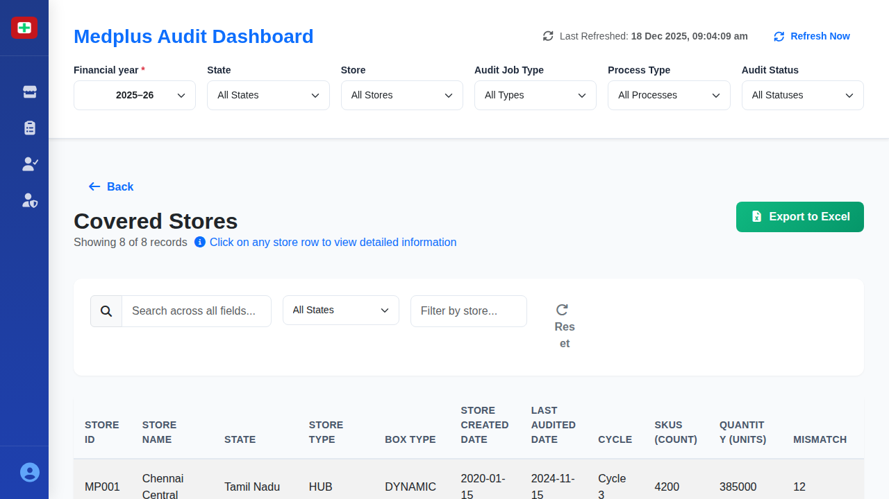

# Covered Stores Details Screen

## When This Screen Appears

This screen appears when a user clicks on the "Covered Stores" card from the main dashboard. It displays after clicking "Click for details" on the green card showing 418 covered stores (87.4% of total).

## Complete UI Breakdown

### Header Section

**Back Button**
- Blue left arrow icon with "Back" text
- Located at top left
- Purpose: Returns user to the main dashboard
- When clicked: Navigates back to dashboard, maintaining previous filter selections

**Page Title: "Covered Stores"**
- Large heading displayed prominently
- Confirms which store category is being viewed

**Record Count and Instruction**
- First line: "Showing 8 of 8 records"
- Second line with info icon: "Click on any store row to view detailed information"
- Purpose: Informs user about available data and interaction method
- Blue info icon draws attention to the instruction

**Export to Excel Button**
- Green button with download icon
- Located at top right
- Purpose: Downloads all covered store data to Excel file
- When clicked: File downloads immediately with all table columns

### Filter and Search Bar

Four input controls for refining the displayed data:

**Search Box**
- Placeholder text: "Search across all fields..."
- Magnifying glass icon on left
- Purpose: Performs text search across all visible columns
- Behavior: Updates table results as user types (real-time filtering)
- Searches in: Store ID, Store Name, Supervisor, Auditor names, etc.

**State Filter Dropdown**
- Default: "All States"
- Options include: Tamil Nadu, Karnataka, Telangana, Maharashtra, Delhi, Gujarat, West Bengal
- Purpose: Filter stores by geographic location
- When changed: Table updates to show only stores in selected state

**Store Name Filter Box**
- Placeholder: "Filter by store..."
- Purpose: Allows filtering by partial store name
- Behavior: Updates as user types

**Reset Button**
- Gray circular arrow icon with "Reset" text
- Purpose: Clears all filters and search terms
- When clicked: All filters reset, full unfiltered list reappears

### Data Table

**Table Structure**
- Multi-column layout with horizontal scrolling
- Header row with sortable column titles
- Data rows with hover effects
- Rows are clickable to open detailed modal

**Column Headers** (left to right):

1. **STORE ID**
   - Format: MP### (e.g., MP001, MP002)
   - Purpose: Unique identifier for each store

2. **STORE NAME**
   - Store location name (e.g., "Chennai Central", "Bangalore Hub")
   - Purpose: Human-readable store identifier

3. **STATE**
   - Full state name
   - Purpose: Geographic location

4. **STORE TYPE**
   - Values: "HUB" or "REGULAR"
   - Purpose: Classification by store function and size

5. **BOX TYPE**
   - Values: "DYNAMIC" or "REGULAR"
   - Purpose: Indicates inventory management method

6. **STORE CREATED DATE**
   - Format: YYYY-MM-DD
   - Purpose: Shows when store was added to system

7. **LAST AUDITED DATE**
   - Format: YYYY-MM-DD
   - Purpose: Shows most recent audit completion date
   - Important for compliance tracking

8. **CYCLE**
   - Format: "Cycle #" (e.g., "Cycle 3", "Cycle 2")
   - Purpose: Indicates which audit cycle this store is currently in

9. **SKUS (count)**
   - Numeric value showing unique products
   - Purpose: Indicates inventory complexity

10. **QUANTITY (units)**
    - Total units across all SKUs
    - Purpose: Shows inventory volume

11. **MISMATCH**
    - Numeric count of inventory discrepancies
    - Purpose: Highlights audit findings that need attention

12. **DEVIATION**
    - Numeric count of deviations found
    - Purpose: Indicates number of inventory issues

13. **STATUS**
    - Displays as green badge with "Active" text
    - Purpose: Shows operational status

14. **INVENTORY VALUE MRP (₹)**
    - Format: ₹###,### (e.g., ₹125,000)
    - Purpose: Total retail value of inventory

**Sample Data Rows:**
- MP001 | Chennai Central | Tamil Nadu | HUB | DYNAMIC | 2020-01-15 | 2024-11-15 | Cycle 3 | 4200 | 385000 | 12 | 4 | Active | ₹125,000
- MP002 | Bangalore Hub | Karnataka | HUB | DYNAMIC | 2019-08-20 | 2024-11-20 | Cycle 3 | 3900 | 425000 | 8 | 3 | Active | ₹198,000

### Row Interaction

**Default State**
- Rows display with standard background
- Text is clearly readable
- All columns visible

**Hover State**
- When mouse moves over a row:
  - Entire row background changes to light gray
  - Cursor changes to pointer (hand icon)
  - Visual indication that row is clickable
- Purpose: Shows that detailed information is available

**Click Behavior**
- Click anywhere on a row:
  - Modal window opens over the current screen
  - Background dims slightly
  - Detailed store information appears in modal
  - Main screen remains in background but is not interactive
- Purpose: Provides access to comprehensive audit details

## Interaction Behavior

### Search and Filter
- Type in search box: Table filters in real-time showing matching rows
- Search is case-insensitive and searches all columns
- Select state: Immediately filters to show only that state's stores
- Store name filter: Narrows results as you type
- All filters work together using AND logic

### Table Sorting
- Column headers may be clickable for sorting
- Click header: Sorts data by that column (ascending/descending toggle)
- Visual indicator (arrow) shows sort direction

### Row Click to Open Modal
- Click any row: Store Detail Modal opens
- Modal displays comprehensive audit information
- Background screen dims and becomes non-interactive
- Modal can be closed to return to table view

### Export Process
- Click "Export to Excel":
  - Downloads current filtered view
  - Includes all columns from the table
  - File name includes date and "covered-stores"
  - No confirmation dialog

### Reset and Clear
- Click Reset: All filters clear, search box empties
- Full dataset reappears in table
- No confirmation needed

### Back Navigation
- Click Back button:
  - Returns to main dashboard
  - Filter selections on dashboard are preserved
  - Smooth transition animation

## Purpose of Every Action

**Back Button**
- Business purpose: Quick navigation to overview for decision-making
- Operational purpose: Maintains context when reviewing multiple data views

**Interactive Instruction**
- Business purpose: Educates managers on how to access detailed data
- Operational purpose: Reduces support requests by providing clear guidance

**Search and Filters**
- Business purpose: Focus analysis on specific geographic regions or problem stores
- Operational purpose: Quickly locate stores with high mismatch/deviation counts

**Clickable Rows**
- Business purpose: Provides drill-down capability from summary to detail
- Operational purpose: Access to auditor performance, deviation breakdowns, and inventory analysis

**Export to Excel**
- Business purpose: Enable offline reporting and analysis
- Operational purpose: Share data with stakeholders, create presentations

**Mismatch and Deviation Columns**
- Business purpose: Highlight stores with inventory discrepancies requiring attention
- Operational purpose: Prioritize follow-up actions and store visits

**Cycle Information**
- Business purpose: Track audit frequency and compliance
- Operational purpose: Ensure stores meet required audit schedule

**Last Audited Date**
- Business purpose: Identify stores approaching next audit due date
- Operational purpose: Support audit scheduling and resource allocation

## Visual Documentation

The screenshot shows the comprehensive table with all audit-related columns. Notice the "Click on any store row" instruction at the top, and the cursor pointer indication on rows. The Mismatch and Deviation columns show which stores have inventory discrepancies that may require managerial attention. All stores show "Active" status with green badges.
