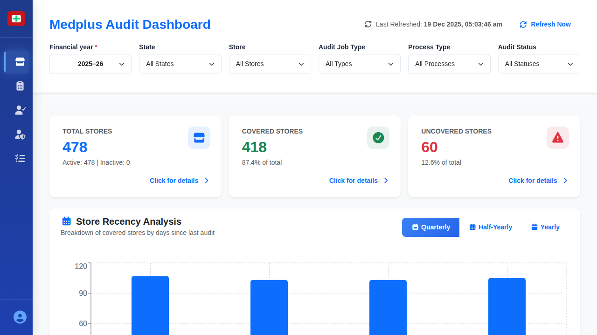

# Dashboard Main Screen

## When This Screen Appears

This screen appears immediately when you open the application. It is the first view users see after launching the system and serves as the central hub for monitoring store audit coverage and inventory status.

## Complete UI Breakdown

### Header Section

**Page Title: "Medplus Audit Dashboard"**
- Displayed prominently at the top left
- Helps users confirm they are on the main dashboard

**Last Refreshed Indicator**
- Shows the exact date and time when data was last updated
- Format: "Last Refreshed: 18 Dec 2025, 09:04:09 am"
- Purpose: Ensures users know how current the displayed information is

**Refresh Now Button**
- Located next to the last refreshed time
- Green button with refresh icon
- Purpose: Allows users to manually update all dashboard data to the latest values

### Filter Controls Bar

Six dropdown filters arranged horizontally allow users to narrow down the data displayed:

**Financial Year Dropdown** (Required - marked with *)
- Default selection: "2025–26"
- Other options: "2024–25", "2023–24", "2022–23"
- Purpose: Filter all data by fiscal year
- When changed: All cards, charts, and metrics update to show data for the selected year

**State Dropdown**
- Default: "All States"
- Options include: Tamil Nadu, Karnataka, Andhra Pradesh, Telangana, Kerala
- Purpose: Filter data by geographic location
- When changed: Updates all metrics to show only selected state's data

**Store Dropdown**
- Default: "All Stores"
- Options: "HUB", "Regular"
- Purpose: Filter by store type classification
- When changed: Displays metrics for only the selected store type

**Audit Job Type Dropdown**
- Default: "All Types"
- Options: "Full Audit", "Select SKUs", "Partial Audit"
- Purpose: Filter by the scope of audit work
- When changed: Shows data for specific audit types only

**Process Type Dropdown**
- Default: "All Processes"
- Options: "Product Audit", "Batch Audit"
- Purpose: Filter by audit methodology
- When changed: Updates to show metrics for the selected process

**Audit Status Dropdown**
- Default: "All Statuses"
- Options: "Created", "In Progress", "Pending", "Completed"
- Purpose: Filter by audit completion state
- When changed: Shows only stores matching the selected status

### Summary Cards Section

**Export Summary Button**
- Green button located at the top right of the summary section
- Icon: Download symbol
- Purpose: Downloads a comprehensive summary report of all dashboard data
- When clicked: Generates and downloads an Excel or PDF file with current filtered data

Three large metric cards display key store statistics:

**Total Stores Card**
- Icon: Blue store building icon
- Main number: "478" (large, prominent)
- Purpose: Shows the total count of all stores in the system
- Hover state: Card background changes slightly
- "Click for details" link at bottom
- When clicked: Navigates to a detailed table showing all stores with their information

**Covered Stores Card**
- Icon: Green checkmark icon
- Main number: "418" (large, blue)
- Percentage: "87.4% of total" (smaller text below)
- Purpose: Shows how many stores have been audited
- Hover state: Card background changes slightly
- "Click for details" link at bottom
- When clicked: Opens detailed view of all covered stores with audit information

**Uncovered Stores Card**
- Icon: Red warning triangle
- Main number: "60" (large, red)
- Percentage: "12.6% of total" (smaller text below)
- Purpose: Shows stores that have not been audited yet
- Hover state: Card background changes slightly
- "Click for details" link at bottom
- When clicked: Opens detailed view of uncovered stores requiring attention

### Store Recency Analysis Chart

**Chart Header**
- Title: "Store Recency Analysis"
- Subtitle: "Breakdown of covered stores by days since last audit"
- Purpose: Helps managers understand audit freshness

**Chart Controls**
- Export button (green) on the right: Downloads chart data
- Three view toggle buttons:
  - "Quarterly" (default selected, blue background)
  - "Half-Yearly" (gray background)
  - "Yearly" (gray background)
- Purpose: Switch between different time period views
- When clicked: Chart updates to show selected timeframe breakdown

**Bar Chart Display**
- Horizontal bar chart with quarterly breakdown
- X-axis: Days since last audit (0, 30, 60, 90, 120)
- Y-axis: Quarter labels (Oct-Dec, Jul-Sep, Apr-Jun, Jan-Mar)
- Blue bars show store count for each period
- Purpose: Visual representation of audit recency distribution
- Hover state: Shows exact values for each bar

### Inventory Metrics Cards

Three cards displaying aggregate inventory information:

**Total SKUs Card**
- Main number: "1,729,130" (large, blue)
- Label: "Total SKUs"
- Subtitle: "Across all covered stores"
- Purpose: Shows total unique product count across all audited stores

**Total Quantity Card**
- Main number: "7.4Cr" (Crores)
- Label: "Total Quantity"
- Subtitle: "Units in inventory"
- Purpose: Displays total units of all products in stock

**Total Inventory Value Card**
- Main number: "₹11769.22L" (Lakhs)
- Label: "Total Inventory Value"
- Subtitle: "Aggregate value"
- Purpose: Shows total monetary value of all inventory

### Deviation Distribution Section

**Deviation Distribution Pie Chart**
- Header: "Deviation Distribution"
- Subtitle: "Click on segments for details"
- Legend showing four categories with values:
  - Invoiced: ₹5707K (gray)
  - Contra Short: ₹6034K (blue)
  - Contra Excess: ₹5714K (orange)
  - Excess Submitted: ₹6397K (purple)
- Interactive pie chart with colored segments
- Purpose: Shows distribution of inventory discrepancies
- Click behavior: Clicking a segment filters other views to that deviation type
- Hover behavior: Segment highlights and shows percentage

### Deviation Summary Section

**Section Header**
- Title: "Deviation Summary"
- Subtitle: "Click on a pie segment for details"
- Export button (green) on the right

**Overall Product Form Distribution**
- Subheading: "Overall Product Form Distribution"
- Note: "Across all deviation types"
- Donut chart showing product categories
- List of product forms with values (10 categories):
  - Injection: ₹2,647,772 / 5480 items
  - Liquids: ₹2,612,180 / 6010 items
  - General: ₹2,509,308 / 5362 items
  - Inhalers: ₹2,439,249 / 5476 items
  - Containers: ₹2,420,339 / 5627 items
  - Ointments: ₹2,331,716 / 4986 items
  - Powders: ₹2,288,196 / 5392 items
  - Surgicals: ₹2,273,320 / 4891 items
  - Drops: ₹2,194,744 / 5088 items
  - Tablets: ₹2,135,633 / 4590 items
- Bottom instruction: "Click on any deviation segment to see specific breakdown"
- Purpose: Shows which product types have the most deviations

## Interaction Behavior

### Loading and Refresh
- On page load: All data appears with current filter selections
- Click "Refresh Now": Screen briefly shows loading state, then updates all values
- No page reload occurs - data updates in place

### Filter Changes
- Select any dropdown: All dashboard metrics update immediately
- Multiple filters can be combined
- Changes persist during the session

### Card Clicks
- Click any summary card: Transitions to details page
- Animation: Smooth slide transition
- Back button appears on detail page to return to dashboard

### Chart Interactions
- Hover over bars: Tooltip shows exact numbers
- Click pie segments: Other sections filter to show that category
- Time period toggles: Chart redraws with new data

### Export Actions
- Click Export Summary: File downloads immediately
- Click chart Export: Downloads chart data as spreadsheet
- No confirmation dialog appears

## Purpose of Every Action

**Refresh Now Button**
- Business purpose: Ensures managers make decisions on current data
- Operational purpose: Fetches latest audit completion status from all stores

**Filter Controls**
- Business purpose: Allows focused analysis on specific regions, time periods, or audit types
- Operational purpose: Helps identify coverage gaps or issues in particular segments

**Summary Cards**
- Business purpose: Provides executive-level overview of audit coverage
- Operational purpose: Quick identification of coverage gaps requiring attention

**Click for Details Links**
- Business purpose: Enables drilling down into problematic areas
- Operational purpose: Access to store-level data for action planning

**Store Recency Chart**
- Business purpose: Identifies stores overdue for audits
- Operational purpose: Helps prioritize scheduling of next audit cycles

**Inventory Metrics**
- Business purpose: Shows scale and value of inventory being managed
- Operational purpose: Validates audit scope and resource allocation

**Deviation Distribution**
- Business purpose: Highlights areas of inventory discrepancy
- Operational purpose: Identifies patterns in inventory management issues

**Export Buttons**
- Business purpose: Enables offline review and reporting to stakeholders
- Operational purpose: Creates documentation for audit trails

## Visual Documentation

The screenshot shows the complete dashboard with all summary cards, charts, and metrics. The blue color scheme indicates the default state with all filters set to show comprehensive data across all stores.
