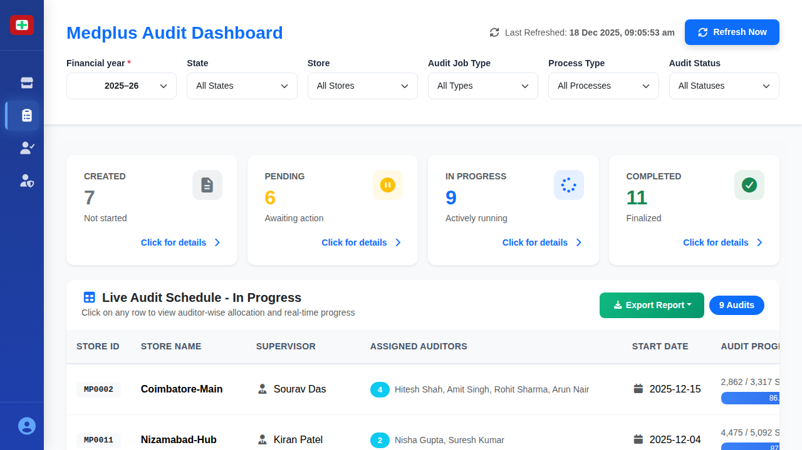

# Live Audit Schedule Screen

## When This Screen Appears

This screen appears when:
- User clicks "Live Audit" in the sidebar navigation
- User wants to monitor ongoing audits and their progress
- User needs to see which auditors are assigned to which stores

*Live Audit Schedule showing in-progress audits with detailed metrics*

## Complete UI Breakdown

### Audit Status KPI Cards (Top Row)

#### Created Audits Card
- **Title**: "CREATED"
- **Large Number**: "7"
- **Subtitle**: "Not started"
- **Icon**: Gray document icon
- **Link**: "Click for details"
- **Purpose**: Shows audits that have been scheduled but not yet begun
- **What the number represents**: Count of audits created and ready to start
- **What happens on click**: Shows detailed table of all created audits
- **Business purpose**: Track audit backlog and ensure timely starts

#### Pending Audits Card
- **Title**: "PENDING"
- **Large Number**: "6"
- **Subtitle**: "Awaiting action"
- **Icon**: Yellow/orange clock icon
- **Link**: "Click for details"
- **Purpose**: Shows audits waiting for supervisor action or approval
- **What the number represents**: Audits requiring intervention or decision
- **What happens on click**: Displays list of audits needing attention
- **Business purpose**: Identify bottlenecks in audit workflow

#### In Progress Audits Card
- **Title**: "IN PROGRESS"
- **Large Number**: "9"
- **Subtitle**: "Actively running"
- **Icon**: Blue progress/loading icon
- **Link**: "Click for details"
- **Active state**: Currently displayed section
- **Purpose**: Shows audits currently being conducted
- **What the number represents**: Count of audits with auditors actively working
- **What happens on click**: Shows the table displayed below (current view)
- **Business purpose**: Monitor real-time audit activity

#### Completed Audits Card
- **Title**: "COMPLETED"
- **Large Number**: "11"
- **Subtitle**: "Finalized"
- **Icon**: Green checkmark icon
- **Link**: "Click for details"
- **Purpose**: Shows successfully finished audits
- **What the number represents**: Audits that have been completed and approved
- **What happens on click**: Displays completed audit list with final metrics
- **Business purpose**: Track audit completion rate

### Table Header Section

#### Title
- **Label**: "Live Audit Schedule - In Progress"
- **Purpose**: Identifies which audit status is currently displayed
- **Changes based on**: Which status card is selected

#### Subtitle
- **Text**: "Click on any row to view auditor-wise allocation and real-time progress"
- **Purpose**: Instructs users on how to access detailed information
- **Interaction hint**: Tells users rows are clickable

#### Export Report Button
- **Label**: "Export Report"
- **Type**: Green button with download icon
- **Purpose**: Download table data to file
- **What happens on click**: Generates report with all visible audit information

#### Audit Count Badge
- **Label**: "9 Audits"
- **Type**: Blue badge
- **Purpose**: Shows total number of audits in current view
- **Updates dynamically**: Changes based on status filter

### Live Audit Table

#### Column Headers
1. **Store ID**: Unique identifier for the store being audited
2. **Store Name**: Name of the store location
3. **Supervisor**: Name of supervisor overseeing this audit
4. **Assigned Auditors**: Number and names of auditors working on this audit
5. **Start Date**: When audit began
6. **Audit Progress**: Visual progress bar with completion percentage
7. **Actions**: Additional action buttons (if any)

#### Assigned Auditors Column Detail
- **Number Badge**: Blue circular badge showing count (e.g., "4")
- **Names List**: Comma-separated auditor names
- **Hover behavior**: May show tooltip with full names if truncated

#### Audit Progress Column Detail
- **Text Display**: "X / Y SKUs" (completed / total)
- **Progress Bar**: Horizontal bar showing percentage visually
- **Percentage**: Numerical completion rate (e.g., "86.3%")
- **Color coding**: Blue bar indicates normal progress
- **Purpose**: Show how much of the audit is complete

#### Sample Row Data
- **MP0002** - Coimbatore-Main - Sourav Das - 4 auditors (Hitesh Shah, Amit Singh, Rohit Sharma, Arun Nair) - 2025-12-15 - 2,862/3,317 SKUs - 86.3%
- **MP0011** - Nizamabad-Hub - Kiran Patel - 2 auditors (Nisha Gupta, Suresh Kumar) - 2025-12-04 - 4,475/5,092 SKUs - 87.9%
- Additional rows follow similar pattern

#### Row Hover State
- When user hovers over a row:
  - Row highlights with light background color
  - Cursor changes to pointer
  - Visual feedback that row is clickable

## Interaction Behavior

### Status Card Selection
1. User clicks on any of the four status cards
2. Selected card highlights
3. Table title updates to match selected status
4. Table reloads with audits of that status
5. Audit count badge updates
6. Progress indicators adjust for the new dataset

### Row Click Flow
1. User clicks on any table row
2. Store Detail Modal opens (overlay)
3. Modal shows comprehensive audit information for that store
4. Background screen remains visible but dimmed
5. User can close modal to return to table

### Progress Monitoring
1. Users can see real-time completion percentages
2. Progress bars provide visual quick assessment
3. Lower percentages (red/yellow zones) indicate audits needing attention
4. Higher percentages (green zones) indicate on-track audits

### Export Action
1. User clicks "Export Report" button
2. System generates report file containing:
   - All visible table rows
   - Store IDs and names
   - Supervisor assignments
   - Auditor allocations
   - Progress metrics
3. File downloads to user's device
4. Can be opened in Excel or PDF viewer

### Supervisor Name Click
- **Purpose**: May navigate to supervisor detail view
- **What it shows**: All stores managed by that supervisor
- **Business use**: Review supervisor workload

## Purpose of Every Action

### Status Card Monitoring
- **Operational purpose**: Track audit workflow stages
- **Decision support**: Identify bottlenecks in created or pending stages
- **Resource allocation**: Ensure balanced distribution across statuses
- **Performance tracking**: Monitor completion rate

### Progress Tracking
- **Operational purpose**: Monitor audit completion in real-time
- **Decision support**: Identify slow-moving audits requiring intervention
- **Time management**: Ensure audits complete within expected timeframes
- **Resource reallocation**: Move auditors from fast audits to slow ones

### Supervisor Assignment View
- **Operational purpose**: See who is responsible for each audit
- **Decision support**: Balance workload across supervisors
- **Accountability**: Know who to contact about specific audits
- **Escalation path**: Identify appropriate person for questions

### Auditor Assignment View
- **Operational purpose**: Track which auditors are working on which stores
- **Decision support**: Ensure appropriate staffing levels
- **Workload balancing**: Distribute work evenly across auditors
- **Performance correlation**: Connect audit progress to specific team members

### Export Functionality
- **Operational purpose**: Share audit status with stakeholders
- **Decision support**: Analyze patterns in audit progress offline
- **Reporting**: Create status reports for management
- **Historical tracking**: Maintain records of audit timelines
