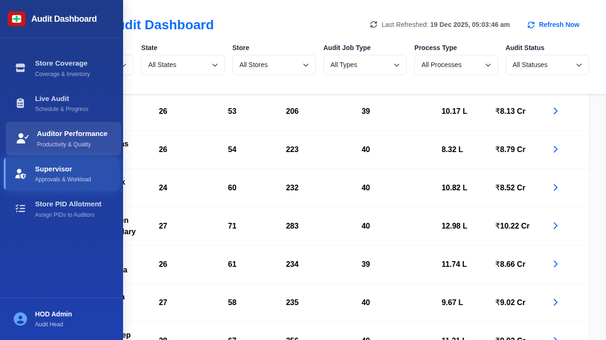

# Supervisor Approvals Screen

## When This Screen Appears

This screen appears when:
- User clicks on "Supervisor" in the sidebar navigation
- Used to monitor supervisor workload and audit oversight
- Tracks approvals and supervisor performance

## Complete UI Breakdown

### Header and Filters

- Global filter bar remains accessible
- Export Report button for downloading supervisor data

### Summary Metrics Cards

Four cards displaying key metrics:

**Total Supervisors**
- Number: 15
- Shows count of active supervisors

**Total Stores Managed**
- Number: 379
- All stores under supervisor oversight

**Total Audits**
- Number: 876
- Audits supervised across all supervisors

**Total Value**
- Number: ₹130.91 Cr
- Total inventory value supervised

### Supervisor Performance Summary Table

**Table Title**: "Supervisor Performance Summary"
**Subtitle**: "Click on any supervisor to view detailed performance metrics"

**Search Field**
- Placeholder: "Search by supervisor name..."
- Filters table in real-time

**Table Columns:**
1. ID (e.g., S001, S002)
2. Name (supervisor name)
3. Stores Managed (count)
4. Total Audits (count)
5. Days Supervised (total days)
6. Auditors Supervised (count)
7. Total SKUs (audited)
8. Total Value (inventory value)
9. Actions (empty column)

**Sample Data:**
- S001 Aditya Reddy: 26 stores, 53 audits, 206 days, 39 auditors, 10.17 L SKUs, ₹8.13 Cr
- S002 Srinivas Rao: 26 stores, 54 audits, 223 days, 40 auditors, 8.32 L SKUs, ₹8.79 Cr
- S004 Praveen Chowdary: 27 stores, 71 audits, 283 days, 40 auditors, 12.98 L SKUs, ₹10.22 Cr

## Interaction Behavior

### Clicking supervisor rows:
- Opens Supervisor Detail Modal (if implemented)
- Shows stores managed by this supervisor
- Displays auditor teams under their supervision
- Shows approval history and pending items

### Search field:
- Filters supervisors by name or ID
- Updates table instantly

### Column sorting:
- Sort by Stores Managed to see workload distribution
- Sort by Total Value to see responsibility levels
- Sort by Audits to see activity levels

### Export Report:
- Downloads complete supervisor performance data
- Includes all visible columns
- Respects active filters

## Purpose of Every Action

### Workload Monitoring:
- Ensures even distribution of stores across supervisors
- Identifies overloaded or underutilized supervisors
- Supports resource reallocation

### Performance Tracking:
- Days supervised shows experience and availability
- Audits count shows throughput
- Auditors supervised shows span of control

### Value Oversight:
- Higher value indicates greater responsibility
- Helps determine appropriate compensation
- Shows trust and capability level

### Quality Management:
- Supervisors approve audit results
- Track approval speed and accuracy
- Ensure proper oversight of audit quality

## Visual Documentation

*The Supervisor Approvals screen showing workload distribution, performance metrics, and oversight statistics for all supervisors.*
