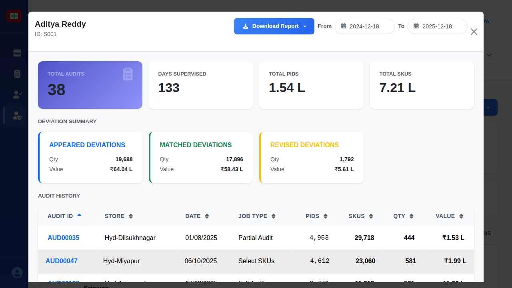

# Supervisor Details Modal

## When This Modal Appears

This modal appears when:
- A user clicks on any supervisor row in the Supervisor Performance Screen table
- Management wants to review detailed performance metrics for a specific supervisor
- A drill-down view of an individual supervisor's workload and quality is needed

## Complete UI Breakdown

### Modal Header

**Supervisor Name and ID**
- **Display**: Large supervisor name (e.g., "Aditya Reddy") with smaller ID below (e.g., "ID: S001")
- **Purpose**: Confirms which supervisor's details are being viewed
- **Location**: Top-left of modal

**Download Report Button**
- **Label**: "Download Report" with download icon
- **Style**: Blue button
- **Location**: Top-right of header
- **Purpose**: Generates a detailed PDF report of this supervisor's performance
- **When clicked**: File downloads immediately with filename like "supervisor-S001-report-YYYY-MM-DD.pdf"
- **Business purpose**: Share supervisor performance data with senior management or HR

**Date Range Selectors**
- **From Date Picker**: Calendar input showing start date (default: one year ago)
- **To Date Picker**: Calendar input showing end date (default: today)
- **Purpose**: Filter all metrics and audit history to specific date range
- **When changed**: All data in modal updates to reflect selected period
- **Business purpose**: Review performance over specific quarters, months, or custom periods

**Close Button (X)**
- **Icon**: X symbol in top-right corner
- **Purpose**: Closes modal and returns to Supervisor Performance Screen
- **When clicked**: Modal disappears with fade-out animation

### Summary Metrics Cards (Top Row)

Four white cards displaying key supervisor statistics:

**Total Audits Card**
- **Value**: Large number (e.g., "38")
- **Style**: Purple/blue background card with audit icon
- **Purpose**: Shows total number of audits this supervisor oversaw in date range
- **Business purpose**: Measure supervisor workload and activity level

**Days Supervised Card**
- **Value**: Large number (e.g., "133")
- **Purpose**: Total days during which supervisor was actively managing audits
- **Business purpose**: Calculate productivity (audits per day supervised)

**Total PIDs Card**
- **Value**: Large number with "L" suffix (e.g., "1.54 L" meaning 154,000)
- **Purpose**: Total Product IDs across all supervised audits
- **Business purpose**: Measure scale of inventory managed

**Total SKUs Card**
- **Value**: Large number with "L" suffix (e.g., "7.21 L" meaning 721,000)
- **Purpose**: Total Stock Keeping Units across all supervised audits
- **Business purpose**: Measure complexity and scope of work supervised

### Deviation Summary Section

**Section Title**: "DEVIATION SUMMARY"
**Purpose**: Shows quality metrics comparing initial audit results with re-audit findings

Three columns with colored borders (blue, green, yellow):

**Appeared Deviations (Blue Border)**
- **Qty Value**: Number of items with discrepancies found (e.g., "19,688")
- **Value Amount**: Total monetary value (e.g., "₹64.04 L")
- **Purpose**: Initial discrepancies identified during supervised audits
- **Business purpose**: Measure accuracy of supervised audit teams

**Matched Deviations (Green Border)**
- **Qty Value**: Number of deviations confirmed as correct (e.g., "17,896")
- **Value Amount**: Monetary value confirmed (e.g., "₹58.43 L")
- **Purpose**: Deviations validated during re-audit process
- **Business purpose**: Quality indicator - higher match rate shows accurate supervision

**Revised Deviations (Yellow Border)**
- **Qty Value**: Number of deviations corrected/adjusted (e.g., "1,792")
- **Value Amount**: Value of corrections (e.g., "₹5.61 L")
- **Purpose**: Deviations that required revision after review
- **Business purpose**: Lower numbers indicate higher supervision quality

### Audit History Table

**Section Title**: "AUDIT HISTORY"
**Purpose**: Complete list of all audits supervised by this supervisor

**Table Columns** (left to right):

1. **Audit ID**: Unique identifier (e.g., "AUD00035") - Clickable
2. **Store**: Store name where audit occurred
3. **Date**: Audit completion date (DD/MM/YYYY format)
4. **Job Type**: Type of audit (Full Audit, Partial Audit, Select SKUs)
5. **PIDs**: Number of Product IDs audited
6. **SKUs**: Number of Stock Keeping Units audited
7. **QTY**: Quantity of items audited
8. **Value**: Total monetary value audited (in Lakhs or Crores)

**Row Interaction**:
- **Hover**: Row background lightens slightly, cursor changes to pointer
- **Click on Audit ID**: Opens the Audit Details Modal showing comprehensive information about that specific audit
- **Purpose**: Allows drill-down from supervisor level to individual audit level

**Table Sorting**:
- **Sortable columns**: All columns have sort arrows
- **Click column header**: Sorts ascending first time, descending second time
- **Default sort**: Most recent audits first (by Date, descending)

**Scrolling**:
- **Behavior**: Table scrolls vertically if more than ~10 audits
- **Scroll bar**: Appears on right side of table area
- **Purpose**: View complete audit history even for high-volume supervisors

## Interaction Behavior

### Opening the Modal
- **Trigger**: Click any row in Supervisor Performance Screen
- **Animation**: Modal fades in with semi-transparent dark overlay behind it
- **Effect**: Background screen becomes non-interactive
- **Focus**: Modal receives keyboard focus

### Closing the Modal
Three ways to close:
1. **Click X button**: Standard close action
2. **Click outside modal**: Click on dark overlay area
3. **Press Escape key**: Keyboard shortcut

**When closed**:
- Modal fades out
- Background screen becomes interactive again
- User returns to exact scroll position on Supervisor Performance Screen

### Date Range Modification
- **Select From date**: Calendar picker opens
- **Select To date**: Calendar picker opens
- **After both dates selected**: 
  - All metrics recalculate automatically
  - Audit History table filters to selected date range
  - No page reload required (real-time update)

### Download Report Action
- **Click Download Report button**:
  - Button shows loading spinner briefly
  - PDF file generates server-side
  - Browser download notification appears
  - File downloads to default download folder
  - Filename includes supervisor ID and date range

### Audit ID Click
- **Click any blue Audit ID link**:
  - Current modal (Supervisor Details) remains open in background
  - New modal (Audit Details) opens on top
  - Layered modal approach (two modals stacked)
  - Close Audit Details modal to return to Supervisor Details

## Purpose of Every Action

### View Supervisor Details
- **Business purpose**: Evaluate individual supervisor effectiveness and workload balance
- **Operational purpose**: Identify supervisors who may need training or recognition
- **Management use**: Support performance reviews and workload distribution decisions

### Download Report
- **Business purpose**: Create formal documentation for HR files or management presentations
- **Operational purpose**: Share detailed performance data offline or in meetings
- **Audit trail**: Maintain records of supervisor performance over time

### Filter by Date Range
- **Business purpose**: Compare supervisor performance across different time periods
- **Operational purpose**: Focus on recent performance vs. historical trends
- **Management use**: Evaluate improvement or decline over specific quarters

### View Deviation Metrics
- **Business purpose**: Assess quality and accuracy of supervised audits
- **Operational purpose**: High match rate indicates strong supervision; low match rate suggests need for intervention
- **Quality control**: Track supervision effectiveness quantitatively

### Review Audit History
- **Business purpose**: Understand which stores and audit types this supervisor manages
- **Operational purpose**: Verify supervisor is assigned to appropriate stores and workload
- **Planning purpose**: Inform future assignment decisions based on past experience

### Click Audit ID
- **Business purpose**: Investigate specific audit details when reviewing supervisor performance
- **Operational purpose**: Drill down from supervisor metrics to individual audit quality
- **Problem-solving**: Trace quality issues to specific audits

## Visual Documentation

The screenshot shows the Supervisor Details Modal for Aditya Reddy (ID: S001). The modal displays his performance over the past year: 38 total audits supervised across 133 days, covering 1.54 lakh PIDs and 7.21 lakh SKUs. The Deviation Summary shows strong quality metrics with 91% of appeared deviations being matched (17,896 out of 19,688), indicating accurate supervision. The Audit History table lists all 38 supervised audits chronologically, with the most recent audits at the top. Each audit row is clickable to view detailed audit information. The blue Download Report button allows exporting this data to PDF, and date range pickers enable filtering the view to specific time periods.
