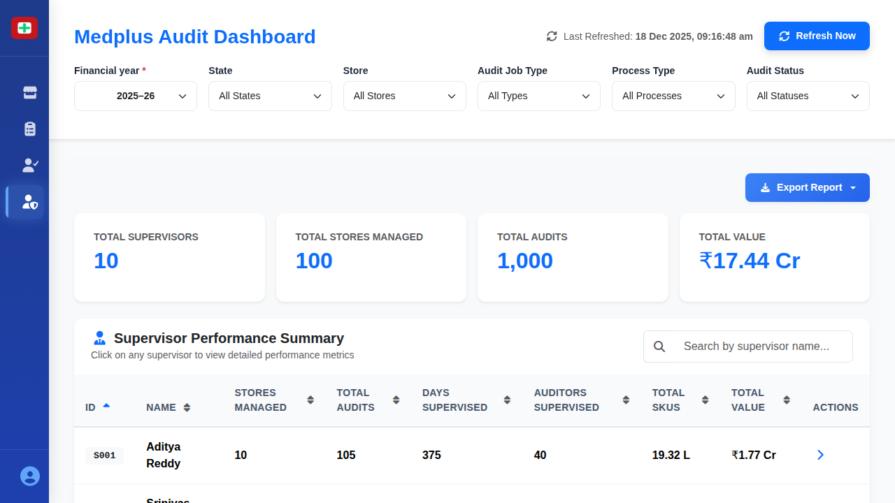

# Supervisor Performance Screen

## When This Screen Appears

This screen appears when:
- User clicks "Supervisor" in the sidebar navigation
- Management needs to review supervisor performance and workload
- Users want to see which supervisors are managing which stores and audits

*Supervisor performance dashboard showing workload and management metrics*

## Complete UI Breakdown

### Export Report Button
- **Label**: "Export Report"
- **Type**: Blue button with download icon
- **Location**: Top-right corner
- **Purpose**: Download comprehensive supervisor performance data
- **What happens on click**: Generates file with all supervisor metrics
- **Business purpose**: Enable management review and workload analysis

### Summary KPI Cards (Top Row)

#### Total Supervisors Card
- **Title**: "Total Supervisors"
- **Large Number**: "10"
- **No subtitle**
- **Icon**: Badge/shield icon
- **Purpose**: Shows total count of supervisors in the system
- **What it represents**: Current supervisor workforce
- **Business purpose**: Track management team size

#### Total Stores Managed Card
- **Title**: "Total Stores Managed"
- **Large Number**: "100"
- **No subtitle**
- **Icon**: Store building icon
- **Purpose**: Shows aggregate count of all stores under supervision
- **What it represents**: Total coverage across all supervisors
- **Business purpose**: Understand scope of supervision

#### Total Audits Card
- **Title**: "Total Audits"
- **Large Number**: "1,000"
- **No subtitle**
- **Icon**: Document icon
- **Purpose**: Shows total number of audits supervised
- **What it represents**: Overall audit volume managed
- **Business purpose**: Track workload magnitude

#### Total Value Card
- **Title**: "Total Value"
- **Large Number**: "₹17.44 Cr" (₹174.4 million)
- **No subtitle**
- **Icon**: Currency icon
- **Purpose**: Shows aggregate inventory value supervised
- **What it represents**: Financial responsibility across all supervisors
- **Business purpose**: Understand financial scope and risk exposure

### Supervisor Performance Table

#### Table Header Section
- **Title**: "Supervisor Performance Summary"
- **Subtitle**: "Click on any supervisor to view detailed performance metrics"
- **Search Box**: "Search by supervisor name..."
  - Real-time filtering as user types
  - Searches across supervisor ID and name

#### Table Column Headers (All Sortable)
1. **ID**: Unique supervisor identifier (e.g., S001, S002)
2. **Name**: Full name of the supervisor
3. **Stores Managed**: Number of stores under this supervisor's oversight
4. **Total Audits**: Count of audits this supervisor has overseen
5. **Days Supervised**: Total days of active supervision
6. **Auditors Supervised**: Number of auditors reporting to this supervisor
7. **Total SKUs**: Aggregate count of products audited under supervision
8. **Total Value**: Monetary value of inventory supervised
9. **Actions**: Additional action buttons (if available)

#### Sort Functionality
- Click header once: Sort ascending
- Click header again: Sort descending
- Visual indicator shows active sort
- Allows finding supervisors with highest/lowest metrics

#### Sample Row Data
- **S001 - Aditya Reddy**: 10 stores, 105 audits, 375 days, 40 auditors, 19.32 L SKUs, ₹1.77 Cr value
- **S002 - Srinivas Rao**: 10 stores, 101 audits, 388 days, 40 auditors, 17.28 L SKUs, ₹1.77 Cr value
- **S003 - Karthik Reddy**: 10 stores, 100 audits, 373 days, 40 auditors, 18.91 L SKUs, ₹1.69 Cr value
- **S004 - Praveen Chowdary**: 10 stores, 83 audits, 329 days, 40 auditors, 14.68 L SKUs, ₹1.36 Cr value
- Additional rows continue with similar metrics

#### Row Hover and Click
- Rows highlight on hover
- Cursor changes to pointer
- Click opens detailed supervisor view
- Shows store assignments, audit history, and team performance

## Interaction Behavior

### Search Functionality
1. User types supervisor name in search box
2. Table filters instantly
3. Only matching supervisors display
4. Search works on partial names
5. Case-insensitive matching

### Sorting Process
1. User clicks column header
2. Table reorganizes by that column
3. Arrow indicator shows sort direction
4. Numerical columns sort by value
5. Text columns sort alphabetically
6. Click again to reverse sort order

### Row Click Flow
1. User clicks on supervisor row
2. Detailed supervisor view opens showing:
   - List of all stores managed
   - Individual audit details
   - Auditor team performance
   - Approval pending items
   - Historical performance trends
3. Back button returns to summary table

### Export Action
1. User clicks "Export Report" button
2. System generates comprehensive file with:
   - All supervisor records
   - Performance metrics for each
   - Workload distribution data
   - Summary statistics
3. File downloads in Excel or PDF format
4. Suitable for executive review and planning

### Performance Comparison
1. Sort by different metrics to identify:
   - Most experienced supervisors (Days Supervised)
   - Highest workload (Total Audits)
   - Largest teams (Auditors Supervised)
   - Most valuable responsibility (Total Value)
2. Identify workload imbalances
3. Make informed staffing decisions

## Purpose of Every Action

### Summary Metrics
- **Operational purpose**: Provide executive-level overview of supervision capacity
- **Decision support**: Understand scale of operations at a glance
- **Resource planning**: Assess if supervisor count is adequate for workload
- **Financial oversight**: Track total value under management

### Total Supervisors Tracking
- **Operational purpose**: Monitor management team size
- **Decision support**: Determine if more supervisors needed
- **Capacity planning**: Match supervisor count to store count
- **Organizational structure**: Understand management hierarchy

### Stores Managed Distribution
- **Operational purpose**: Track how stores are allocated among supervisors
- **Decision support**: Identify overloaded or underutilized supervisors
- **Workload balancing**: Ensure fair distribution of stores
- **Geographic coverage**: Verify all regions have adequate supervision

### Audit Volume Tracking
- **Operational purpose**: Monitor total audit throughput
- **Decision support**: Assess if audit frequency meets requirements
- **Performance measurement**: Track productivity over time
- **Compliance verification**: Ensure all required audits are being conducted

### Days Supervised Metric
- **Operational purpose**: Track supervisor experience and tenure
- **Decision support**: Match experienced supervisors to complex situations
- **Training needs**: Identify new supervisors who may need mentoring
- **Historical context**: Understand long-term involvement in process

### Auditors Supervised Count
- **Operational purpose**: Track team size under each supervisor
- **Decision support**: Balance team sizes for effective management
- **Span of control**: Ensure supervisors aren't managing too many auditors
- **Workload distribution**: Larger teams may indicate higher workload capacity

### SKU Volume Tracking
- **Operational purpose**: Measure scope of inventory supervised
- **Decision support**: Understand complexity of each supervisor's responsibility
- **Performance context**: High SKU counts may explain lower audit counts
- **Resource allocation**: Match supervisor experience to complexity

### Value Under Management
- **Operational purpose**: Track financial responsibility
- **Decision support**: Assign supervisors based on experience and value at risk
- **Risk management**: Ensure high-value inventories have experienced oversight
- **Accountability**: Clear financial responsibility assignment
- **Performance assessment**: Context for evaluating supervisor effectiveness

### Search Capability
- **Operational purpose**: Quickly locate specific supervisors
- **Decision support**: Find supervisors for specific store assignments
- **Efficiency**: Avoid manual scrolling through list
- **Communication**: Quickly identify supervisor contacts

### Detailed View Access
- **Operational purpose**: Deep dive into individual supervisor performance
- **Decision support**: Investigate specific performance questions
- **Problem resolution**: Identify causes of delays or issues
- **Performance reviews**: Gather detailed data for evaluations

### Workload Analysis
- **Operational purpose**: Identify imbalances in work distribution
- **Decision support**: Reassign stores or auditors to balance workload
- **Fairness**: Ensure equitable distribution of responsibilities
- **Efficiency**: Optimize allocation to maximize throughput
- **Burnout prevention**: Identify overloaded supervisors early
