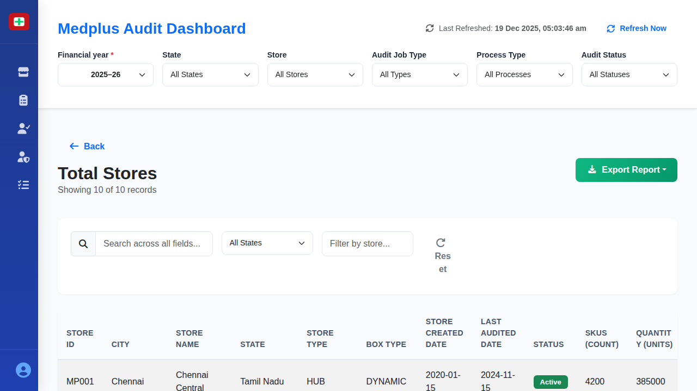

# Total Stores - Details Screen

## Table of Contents
- [When This Screen Appears](#when-this-screen-appears)
- [Complete UI Breakdown](#complete-ui-breakdown)
  - [Header Section](#header-section)
  - [Global Filter Bar](#global-filter-bar)
  - [Search and Filter Section](#search-and-filter-section)
  - [Data Table](#data-table)
  - [Sample Data Rows](#sample-data-rows)
  - [Table Features](#table-features)
- [Interaction Behavior (Step-by-Step)](#interaction-behavior-step-by-step)
  - [Back Button](#back-button)
  - [Export Report Button](#export-report-button)
  - [Search Field](#search-field)
  - [State Dropdown Filter](#state-dropdown-filter)
  - [Store Type Filter Field](#store-type-filter-field)
  - [Reset Button](#reset-button)
  - [Table Column Headers](#table-column-headers)
  - [Table Rows](#table-rows)
- [Purpose of Every Action](#purpose-of-every-action)
  - [Back Button Purpose](#back-button-purpose)
  - [Export Report Purpose](#export-report-purpose)
  - [Search Functionality Purpose](#search-functionality-purpose)
  - [Filter Purpose](#filter-purpose)
  - [Reset Function Purpose](#reset-function-purpose)
  - [Sorting Purpose](#sorting-purpose)
  - [Column Data Purpose](#column-data-purpose)
- [Visual Documentation](#visual-documentation)

## When This Screen Appears

This screen appears when:
- User clicks on the "Total Stores" card on the main dashboard
- User clicks "Click for details" link on the Total Stores summary card
- The screen displays detailed information about all stores in the system

The screen is accessible from the Store Coverage dashboard and shows comprehensive store-level data.

## Complete UI Breakdown

### Header Section

**Back Button**
- Blue left arrow with "Back" text
- Located at top left of content area
- Returns user to Store Coverage dashboard

**Page Title**
- "Total Stores" displayed prominently
- Indicates user is viewing the complete store list

**Record Counter**
- Shows "Showing X of Y records"
- Example: "Showing 10 of 10 records"
- Updates based on filters and search results

**Export Report Button**
- Green button with download icon
- Located at top right
- Text: "Export Report"
- Provides dropdown options when clicked

### Global Filter Bar

The filter bar from the main dashboard remains visible at the top:
- Financial year, State, Store, Audit Job Type, Process Type, Audit Status
- All filters continue to work and affect the data displayed in the table

### Search and Filter Section

**Search Field**
- Placeholder text: "Search across all fields..."
- Located at left of filter row
- Searches through all columns: Store ID, name, city, state, etc.
- Updates results in real-time as user types

**State Dropdown Filter**
- Default: "All States"
- Options include: Tamil Nadu, Karnataka, Telangana, Maharashtra, Delhi, Gujarat, West Bengal, Madhya Pradesh
- Filters table to show only stores in selected state

**Store Type Filter Field**
- Placeholder: "Filter by store..."
- Free-text input field
- Filters stores by name or store type (HUB, REGULAR)

**Reset Button**
- Circular arrow icon with "Reset" text
- Clears all search and filter inputs
- Returns table to show all stores

### Data Table

The table contains the following columns from left to right:

**STORE ID**
- Unique identifier for each store
- Format: MP### (e.g., MP001, MP002)
- Allows quick reference and lookup

**CITY**
- City where store is located
- Examples: Chennai, Bangalore, Hyderabad
- Helps identify geographic location

**STORE NAME**
- Full name of the store
- Examples: "Chennai Central", "Bangalore Hub", "Hyderabad Main"
- Identifies specific location within city

**STATE**
- State where store operates
- Examples: Tamil Nadu, Karnataka, Telangana
- Used for regional analysis

**STORE TYPE**
- Classification of store
- Values: "HUB" or "REGULAR"
- HUB stores typically have higher volume and complexity

**BOX TYPE**
- Indicates storage system used
- Values: "DYNAMIC" or "REGULAR"
- DYNAMIC suggests automated or flexible storage systems

**STORE CREATED DATE**
- Date when store was added to system
- Format: YYYY-MM-DD (e.g., 2020-01-15)
- Helps track store age and maturity

**LAST AUDITED DATE**
- Date of most recent audit completion
- Format: YYYY-MM-DD (e.g., 2024-11-15)
- Critical for assessing audit recency

**STATUS**
- Current operational status
- Displayed as colored badge: "Active" in green
- Inactive stores would show different color (if any exist)

**SKUS (count)**
- Number of unique product types (Stock Keeping Units)
- Numeric value (e.g., 4200, 3900)
- Indicates store size and complexity

**QUANTITY (units)**
- Total number of individual product units
- Large numbers (e.g., 385000, 425000)
- Represents inventory volume

**INVENTORY VALUE MRP (₹)**
- Total value of inventory at Maximum Retail Price
- Displayed in Indian Rupees
- Format: ₹###,### (e.g., ₹125,000, ₹198,000)
- Represents financial value at risk

### Sample Data Rows

The table shows stores including:

**MP001 - Chennai Central**
- City: Chennai
- State: Tamil Nadu
- Type: HUB / DYNAMIC
- Created: 2020-01-15
- Last Audited: 2024-11-15
- Status: Active
- SKUs: 4200
- Quantity: 385000 units
- Value: ₹125,000

**MP002 - Bangalore Hub**
- City: Bangalore
- State: Karnataka
- Type: HUB / DYNAMIC
- Created: 2019-08-20
- Last Audited: 2024-11-20
- Status: Active
- SKUs: 3900
- Quantity: 425000 units
- Value: ₹198,000

**MP003 - Hyderabad Main**
- City: Hyderabad
- State: Telangana
- Type: REGULAR / REGULAR
- Created: 2020-03-12
- Last Audited: 2024-10-28
- Status: Active
- SKUs: 5200
- Quantity: 498000 units
- Value: ₹167,000

### Table Features

**Scrolling**
- Table scrolls horizontally if columns don't fit screen width
- Table scrolls vertically to show all stores
- Headers remain visible when scrolling vertically

**Row Highlighting**
- Rows may highlight on hover
- Helps user track which row they're viewing

## Interaction Behavior (Step-by-Step)

### Back Button

**On click:**
1. Screen transitions back to Store Coverage dashboard
2. User returns to the main dashboard view
3. All dashboard filters remain as previously set
4. Dashboard data refreshes if any changes occurred

### Export Report Button

**On click:**
1. Dropdown menu appears with export options
2. Options likely include: PDF, Excel, CSV formats
3. User selects desired format

**After selecting format:**
1. Export process begins
2. Loading indicator may appear
3. File downloads to user's computer
4. File contains all visible table data (respecting current filters)
5. File name includes date and "Total_Stores" identifier

### Search Field

**When user types:**
1. Results filter instantly with each keystroke
2. Table updates to show only matching records
3. Record counter updates to show: "Showing X of Y records"
4. Matches can occur in any column

**Search behavior:**
- Case-insensitive search
- Searches across Store ID, City, Store Name, State
- Partial matches are included
- Empty search shows all records

### State Dropdown Filter

**On click:**
1. Dropdown expands showing state options
2. Current selection is highlighted

**When selecting a state:**
1. Dropdown closes
2. Table filters to show only stores in selected state
3. Record counter updates
4. Can be combined with search field

**When selecting "All States":**
1. State filter is removed
2. Table shows stores from all states
3. Other active filters continue to apply

### Store Type Filter Field

**When typing:**
1. Table filters as user types
2. Filters based on store name or store type
3. Can narrow results to specific store patterns
4. Works in combination with other filters

### Reset Button

**On click:**
1. Search field clears
2. State dropdown resets to "All States"
3. Store type filter field clears
4. Table returns to showing all stores
5. Record counter shows total count
6. Global filters (top bar) remain unchanged

### Table Column Headers

**When clicking column headers:**
1. Table sorts by that column
2. First click: Ascending order (A-Z or lowest-highest)
3. Second click: Descending order (Z-A or highest-lowest)
4. Third click: Returns to default order
5. Arrow icon appears next to sorted column name

**Sortable columns include:**
- Store ID (alphanumeric)
- City (alphabetical)
- Store Name (alphabetical)
- State (alphabetical)
- Last Audited Date (chronological)
- SKUs (numerical)
- Quantity (numerical)
- Inventory Value (numerical)

### Table Rows

**On hover:**
- Row background may change slightly
- Helps user identify which row they're viewing
- Cursor remains as default (not clickable)

**No click action:**
- Individual rows are not clickable in this view
- Data is displayed for viewing only
- To access more details, users must use Export function or return to dashboard

## Purpose of Every Action

### Back Button Purpose

**Business Need:**
- Allows quick navigation back to executive dashboard
- Enables managers to view details then return to overview
- Supports iterative exploration: dashboard → details → dashboard → different details

**User Workflow:**
- View overall store count on dashboard
- Drill into Total Stores for details
- Verify specific stores
- Return to dashboard to check other metrics

### Export Report Purpose

**Business Need:**
- Creates permanent record of store status at specific point in time
- Enables offline analysis and reporting
- Allows sharing with stakeholders who don't have system access
- Supports compliance and audit documentation requirements

**Use Cases:**
- Monthly management reports
- Board presentations
- Audit trail documentation
- Store expansion planning
- Comparative analysis over time

### Search Functionality Purpose

**Business Need:**
- Rapid location of specific stores
- Verification of store data without scrolling
- Quick lookup during phone conversations or meetings

**Use Cases:**
- "Is store MP025 in our system?"
- "What's the status of our Chennai stores?"
- "When was Hyderabad Main last audited?"

### Filter Purpose

**State Filter:**
- Regional managers focus on their territory
- Compare performance across states
- Identify state-specific patterns or issues

**Store Type Filter:**
- Distinguish HUB operations from regular stores
- Analyze different store models separately
- Plan resources based on store characteristics

### Reset Function Purpose

**Business Need:**
- Quick way to clear complex filter combinations
- Prevents user from manually clearing multiple fields
- Ensures clean slate for new search

**Prevents Errors:**
- Users might forget which filters are active
- Hidden filters could confuse results
- Reset provides known starting point

### Sorting Purpose

**Business Need:**
- Identify stores with oldest audit dates (need immediate attention)
- Find stores with highest inventory value (higher risk)
- Locate stores with most SKUs (complexity indicators)
- Alphabetically browse stores by name or location

**Decision Making:**
- Sort by Last Audited Date to prioritize upcoming audits
- Sort by Inventory Value to focus on high-value stores
- Sort by SKUs to identify most complex stores

### Column Data Purpose

**Store ID:**
- Unique identifier prevents confusion between similarly named stores
- Used in all system communications and reports
- Critical for data integrity

**Geographic Information (City, State):**
- Resource planning and logistics
- Regional performance analysis
- Travel and scheduling optimization for auditors

**Store Type & Box Type:**
- Determines audit approach and duration
- HUB stores may require more auditors
- DYNAMIC systems may need specialized training

**Created Date:**
- Newer stores may need more frequent early audits
- Helps assess store maturity and stability
- Identifies recent additions to network

**Last Audited Date:**
- Most critical metric for audit planning
- Identifies overdue audits
- Ensures compliance with audit frequency requirements
- Red flag if too much time has elapsed

**Status:**
- Confirms store is operational
- Inactive stores shouldn't appear in active audit plans
- Helps maintain data accuracy

**SKUs:**
- Indicates audit complexity and duration
- More SKUs = longer audit time
- Helps estimate auditor workload

**Quantity:**
- Represents volume of inventory
- Higher quantities may indicate higher risk
- Affects theft prevention and shrinkage concerns

**Inventory Value:**
- Financial exposure and risk
- Higher value stores need more attention
- Supports insurance and security planning
- Critical for loss prevention focus

## Visual Documentation

*The detailed view showing all stores in a searchable, filterable table format. Each row represents a complete store record with key operational metrics.*
