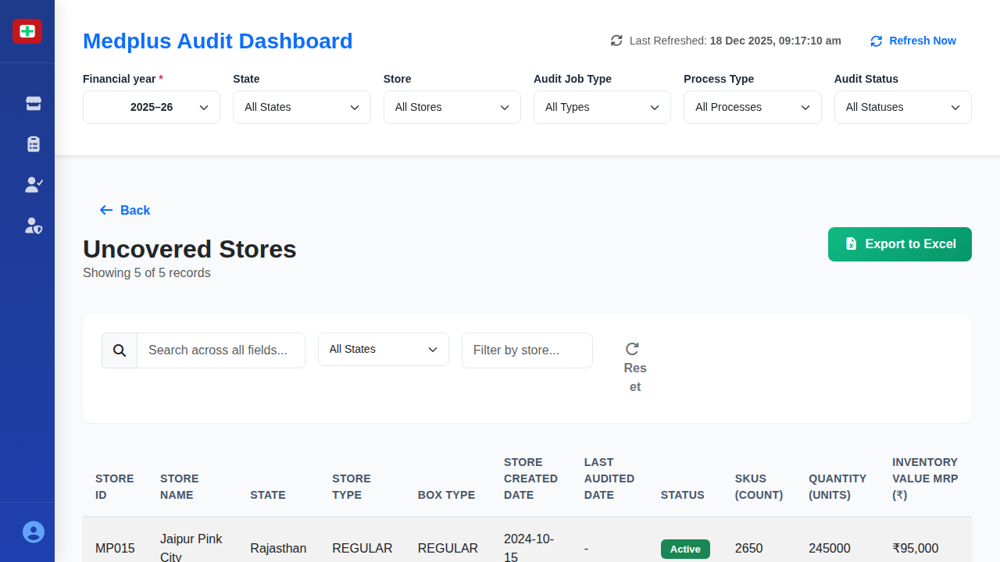

# Uncovered Stores Details Screen

## When This Screen Appears

This screen appears when a user clicks on the "Uncovered Stores" card from the main dashboard. It displays after clicking "Click for details" on the red warning card showing 60 uncovered stores (12.6% of total).

## Complete UI Breakdown

### Header Section

**Back Button**
- Blue left arrow icon with "Back" text
- Located at top left
- Purpose: Returns user to the main dashboard
- When clicked: Navigates back to dashboard with filter selections preserved

**Page Title: "Uncovered Stores"**
- Large heading displayed prominently
- Confirms which store category is being viewed

**Record Count**
- Text: "Showing 5 of 5 records"
- Purpose: Informs user how many stores are displayed versus total available
- Updates dynamically based on filters applied

**Export to Excel Button**
- Green button with download icon
- Located at top right
- Purpose: Downloads all uncovered store data to an Excel file
- When clicked: File downloads immediately with name like "uncovered-stores-YYYY-MM-DD.xlsx"

### Filter and Search Bar

Four input controls for refining the displayed data:

**Search Box**
- Placeholder text: "Search across all fields..."
- Magnifying glass icon on left
- Purpose: Performs text search across all visible columns
- Behavior: Updates table results as user types (real-time filtering)
- Searches in: Store ID, Store Name, State, Store Type, etc.

**State Filter Dropdown**
- Default: "All States"
- Options include: Rajasthan, Uttar Pradesh, Punjab, Madhya Pradesh, Bihar
- Purpose: Filter stores by geographic location
- When changed: Table updates to show only stores in selected state

**Store Name Filter Box**
- Placeholder: "Filter by store..."
- Purpose: Allows filtering by partial store name
- Behavior: Updates as user types

**Reset Button**
- Gray circular arrow icon with "Reset" text
- Purpose: Clears all filters and search terms, returning to default view
- When clicked: All filters reset, full unfiltered list reappears

### Data Table

**Table Structure**
- Multi-column layout with horizontal scrolling if needed
- Header row with column titles
- Data rows with alternating background colors for readability
- Rows are NOT clickable (no detailed audit data available yet)

**Column Headers** (left to right):

1. **STORE ID**
   - Format: MP### (e.g., MP015, MP022)
   - Purpose: Unique identifier for each store

2. **STORE NAME**
   - Store location name (e.g., "Jaipur Pink City", "Lucknow Central")
   - Purpose: Human-readable store identifier

3. **STATE**
   - Full state name (e.g., "Rajasthan", "Uttar Pradesh")
   - Purpose: Geographic location

4. **STORE TYPE**
   - Values: "HUB" or "REGULAR"
   - Purpose: Classification by store function and size

5. **BOX TYPE**
   - Values: "DYNAMIC", "REGULAR", or "Non Box Mapping"
   - Purpose: Indicates inventory management method
   - "Non Box Mapping": Indicates store needs configuration

6. **STORE CREATED DATE**
   - Format: YYYY-MM-DD
   - Purpose: Shows when store was added to system
   - All dates are recent (2024), indicating new stores

7. **LAST AUDITED DATE**
   - Shows "-" (dash) for all uncovered stores
   - Purpose: Confirms these stores have never been audited
   - Visual indicator: Dash emphasizes lack of audit history

8. **STATUS**
   - Displays as green badge with "Active" text
   - Purpose: Shows operational status of store
   - All uncovered stores are active and awaiting first audit

9. **SKUS (count)**
   - Numeric value (e.g., 2650, 2800)
   - Purpose: Number of unique products in this store
   - Helps estimate audit complexity

10. **QUANTITY (units)**
    - Numeric value (e.g., 245000, 298000)
    - Purpose: Total units of all products
    - Helps estimate audit duration

11. **INVENTORY VALUE MRP (₹)**
    - Format: ₹##,### (e.g., ₹95,000, ₹145,000)
    - Purpose: Total retail value of inventory
    - Helps prioritize which stores to audit first

**Sample Data Rows:**
- MP015 | Jaipur Pink City | Rajasthan | REGULAR | REGULAR | 2024-10-15 | - | Active | 2650 | 245000 | ₹95,000
- MP022 | Lucknow Central | Uttar Pradesh | HUB | DYNAMIC | 2024-11-01 | - | Active | 2800 | 298000 | ₹145,000
- MP033 | Chandigarh Hub | Punjab | HUB | DYNAMIC | 2024-09-20 | - | Active | 4100 | 435000 | ₹189,000
- MP041 | Indore Main | Madhya Pradesh | REGULAR | Non Box Mapping | 2024-11-10 | - | Active | 3500 | 342000 | ₹112,000
- MP045 | Patna Central | Bihar | REGULAR | Non Box Mapping | 2024-10-28 | - | Active | 2350 | 218000 | ₹87,000

### Row Interaction

**Default State**
- Rows display with standard background
- Text is clearly readable
- All columns visible without interaction

**Hover State**
- When mouse moves over a row:
  - Background color may lighten slightly
  - Cursor remains normal (arrow, not pointer)
  - No visual indication that row is clickable
- Purpose: Provides visual feedback but indicates no additional data available

**No Click Behavior**
- Rows are NOT clickable
- No modal or detail view opens when clicking a row
- Purpose: These stores have no audit data yet - nothing to display

## Interaction Behavior

### Search Functionality
- Type in search box: Table filters in real-time
- Search is case-insensitive
- Matches partial strings
- Searches across all visible columns simultaneously
- Clear search box: Full list returns

### Filter Application
- Select state from dropdown: Table immediately shows only matching stores
- Multiple filters work together (search + state + store name)
- Filters are additive (AND logic)

### Reset Action
- Click Reset button:
  - Search box clears
  - State dropdown returns to "All States"
  - Store name filter clears
  - Table returns to showing all records
- No confirmation dialog appears

### Export Process
- Click "Export to Excel":
  - File generation happens immediately
  - Browser's download notification appears
  - File includes all columns visible in table
  - Includes currently filtered results (not full dataset if filters applied)
  - Filename includes current date

### Back Navigation
- Click Back button:
  - Smooth transition animation back to dashboard
  - Dashboard loads with same filter settings as before
  - No data is lost or reset

## Purpose of Every Action

**Back Button**
- Business purpose: Allows managers to return to high-level view after identifying gaps
- Operational purpose: Maintains workflow continuity when reviewing coverage

**Record Count Display**
- Business purpose: Shows size of audit coverage gap
- Operational purpose: Helps estimate resources needed for initial audits

**Search and Filters**
- Business purpose: Prioritize which uncovered stores to audit first by location or size
- Operational purpose: Quickly identify stores in specific regions for audit scheduling

**Export to Excel**
- Business purpose: Share list with regional managers for action planning
- Operational purpose: Create work assignments for audit teams

**Table Display**
- Business purpose: Complete visibility into stores lacking audit coverage
- Operational purpose: Supports audit scheduling and resource allocation decisions

**Status Indicator**
- Business purpose: Confirms stores are operational and ready for audit
- Operational purpose: No inactive stores blocking audit scheduling

**Store Created Date**
- Business purpose: Shows these are recently added stores
- Operational purpose: Newer stores may be higher priority for initial baseline audit

**Last Audited Date Column**
- Business purpose: Visual emphasis on lack of audit history
- Operational purpose: Dash ("-") clearly distinguishes uncovered from covered stores

**Inventory Metrics (SKUs, Quantity, Value)**
- Business purpose: Enables priority ranking by inventory complexity or value
- Operational purpose: Helps estimate audit duration and assign appropriate team size

**Box Type Display**
- Business purpose: Identifies stores needing configuration ("Non Box Mapping")
- Operational purpose: May require setup before audit can begin

**Non-Clickable Rows**
- Business purpose: Clear indication that no audit data exists yet
- Operational purpose: Prevents user confusion - clicking would show nothing

## Visual Documentation

The screenshot shows the uncovered stores table with five recently created stores awaiting their first audit. Notice the dash ("-") in the Last Audited Date column for all stores, clearly indicating no audit history. The stores are from various states (Rajasthan, Uttar Pradesh, Punjab, Madhya Pradesh, Bihar) and include both HUB and REGULAR types. Two stores show "Non Box Mapping" indicating they require configuration before auditing can begin. The green "Active" status badges confirm all stores are operational and ready for audit scheduling.
